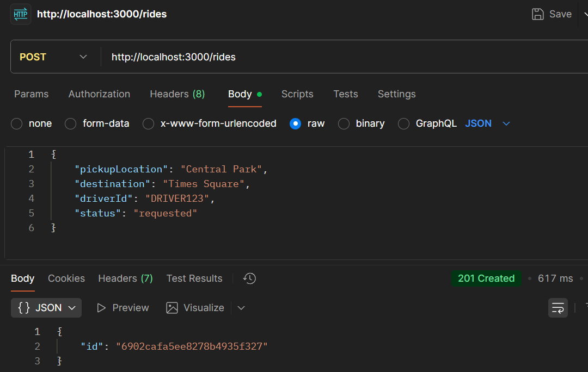
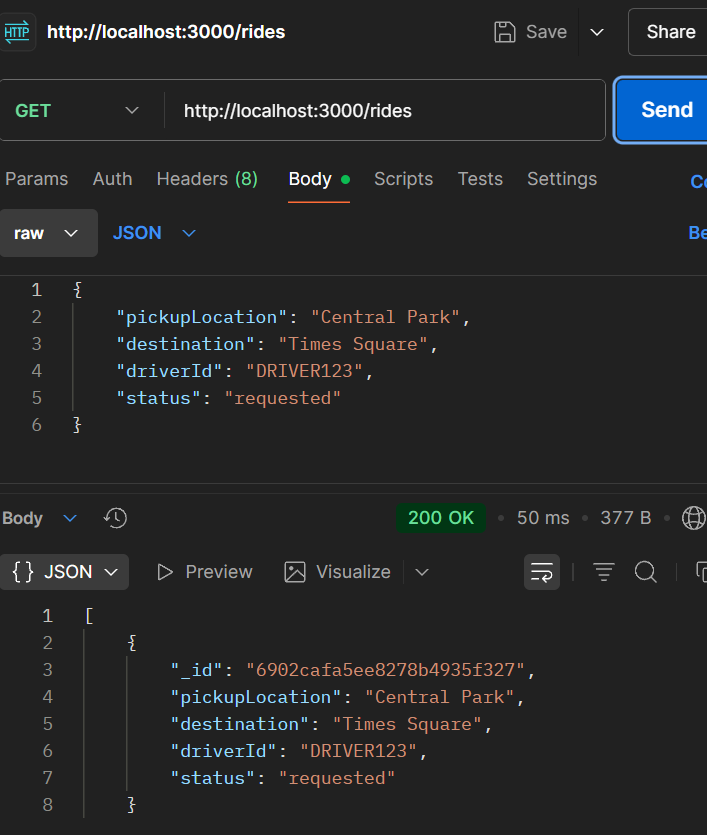
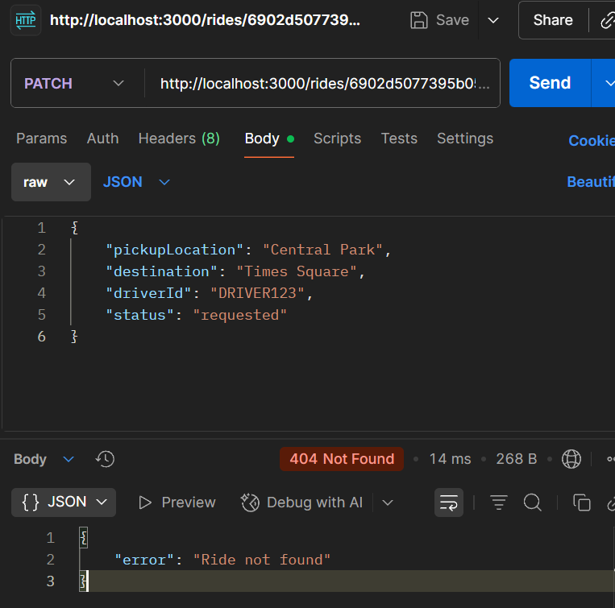
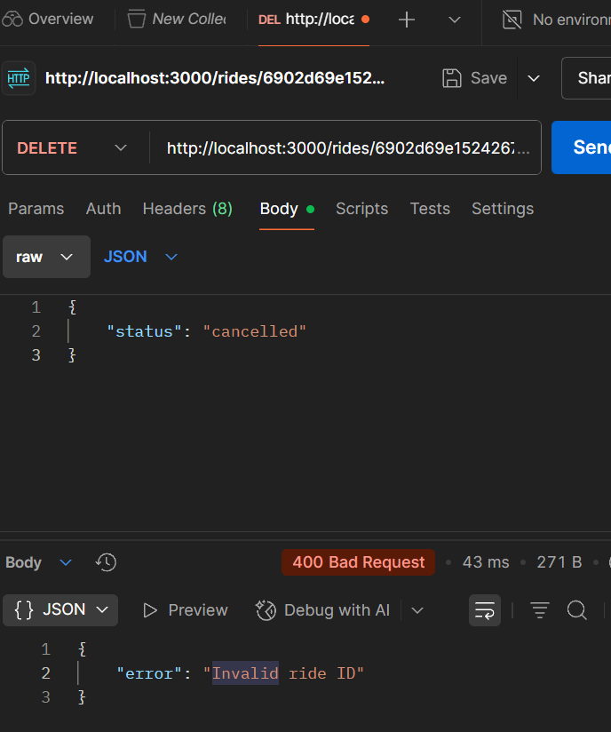

# Hello MongoDB Project

## Installation Steps

### 1. Install VSCode
- Download from [https://code.visualstudio.com](https://code.visualstudio.com)
- Install MongoDB extension.

### 2. Install Node.js and npm
```bash
node -v
npm -v
```

## Week 5 Tasks

### 1. Create a Ride



### 2. Fetch All Rides



### 3. Update Ride Status



### 4. Delete a Ride
