# Hello MongoDB Project

## Installation Steps

### 1. Install VSCode
- Download from [https://code.visualstudio.com](https://code.visualstudio.com)
- Install MongoDB extension.

### 2. Install Node.js and npm
```bash
node -v
npm -v
```

## Week 2 Tasks

### Task 2.1 Read and display the driver’s name into the console
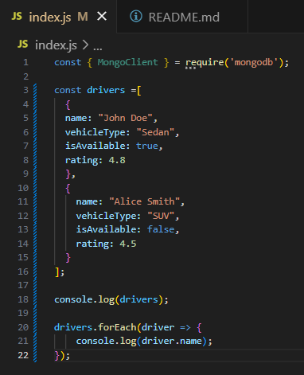
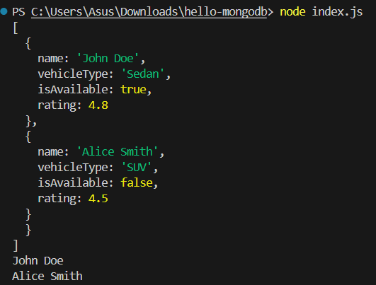


### Task 2.2 Add a new driver directly in the array
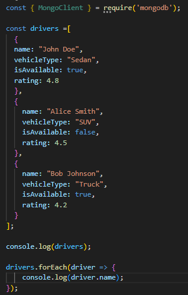


### Task 3 Insert Drivers into MongoDB
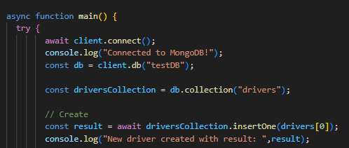
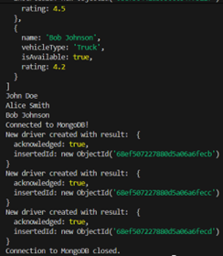
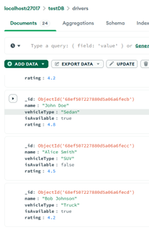


### Task 4 Query and Update Drivers
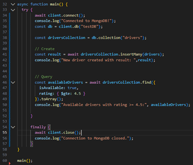


### Task 5 Update
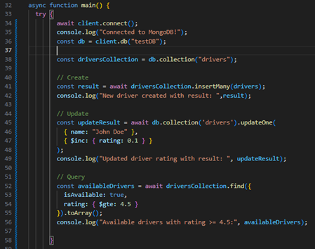
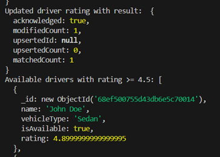
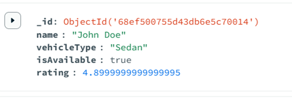


### Task 6 Delete

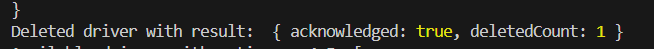


## Lab Questions

### Q1. Explain what is CRUD operations and how it is relates to the mongo functions in the exercise.

### Answer 1:
- C – Create → Adds one or multiple driver documents into the collection.
[]

- R – Read → Retrieves documents from the collection based on certain conditions.
- U – Update → Modifies existing documents that match a filter condition.
- D – Delete → Removes documents that match a filter condition.


## Q2. Identify all the mongo operators used in the exercise, then explain the usage for each.

### Answer 2:
- 


## Q3. Replace the mongo functions in Task 5 to updateMany instead of updateOne, compare the diFerence based on the result in console and the mongo compass.

### Answer 3:

- 


### Q4. Replace the mongo functions in Task 6 to deleteMany instead of deleteOne, compare the diFerence based on the result in console and the mongo compass.

### Answer 4:

- deleteMany operations will delete all