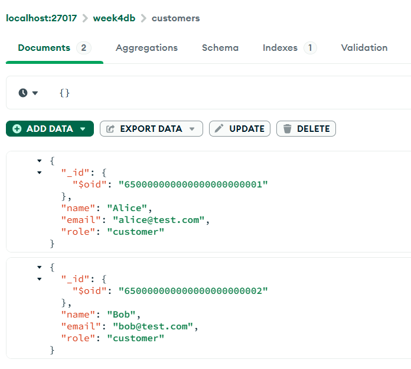
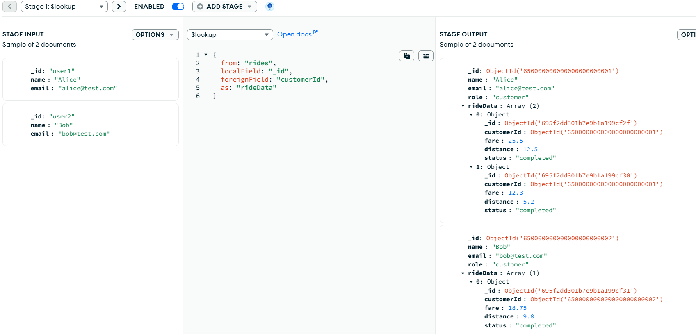
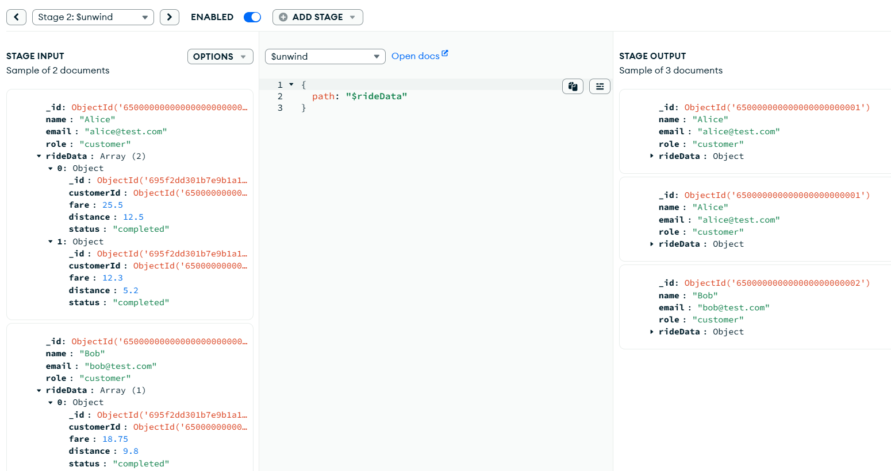
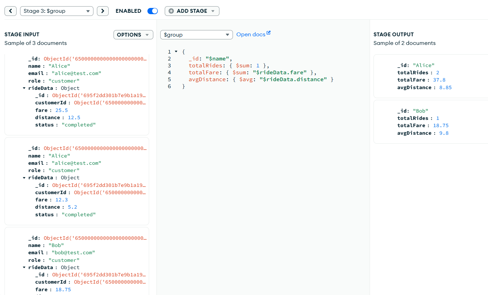
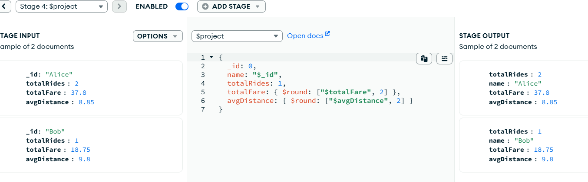
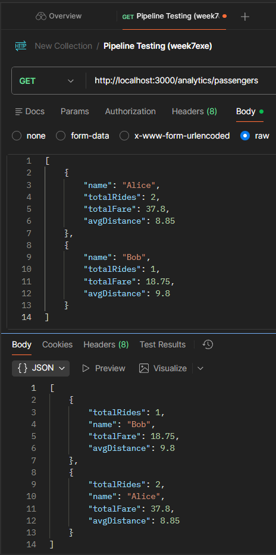
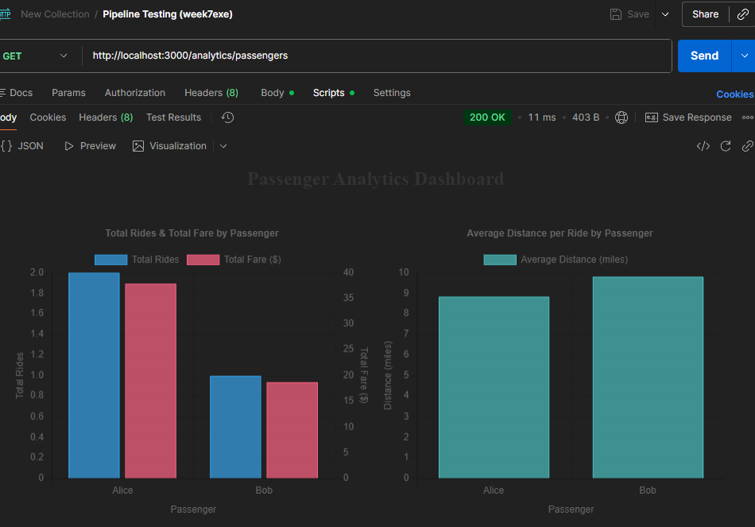

# Hello MongoDB Project

## Installation Steps

### 1. Install VSCode
- Download from [https://code.visualstudio.com](https://code.visualstudio.com)
- Install MongoDB extension.

### 2. Install Node.js and npm
```bash
node -v
npm -v
```

## Week 7 Tasks

## Part 1: Data Preparation
### Inserted sample data for customers collection (Alice & Bob).

### Inserted sample data for rides collection (Alice & Bob).


## Part 2: Pipeline Design in MongoDB Compass
### Built the 4-stage pipeline ($lookup, $unwind, $group, $project).
#### Stage 1: $lookup


#### Stage 2: $unwind


#### Stage 3: $group


#### Stage 4: $project


### Execution of Pipeline (4 Stages)


## Part 3: Node.js Implementation
### Create API Endpoint in index.js to implement GET /analytics/passengers endpoint


## Part 4: Postman Testing
### Test with Postman using http://localhost:3000/analytics/passengers


## Part 5: Analytic Dashboard



### Generate Visualization Dashboard with Postman 


### DESIGN THE ERD Diagram


### DESIGN THE USE CASE DIAGRAM


### DEFINE API SPECIFICATIONS


## MongoDB Data Model Structure
