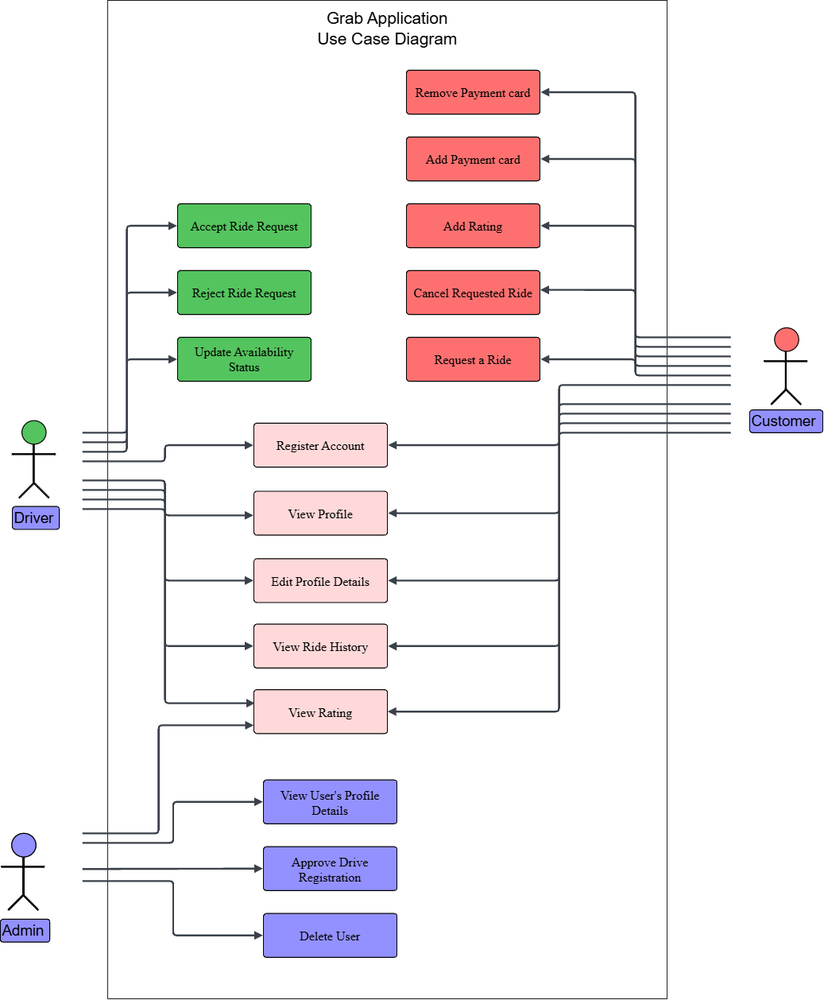
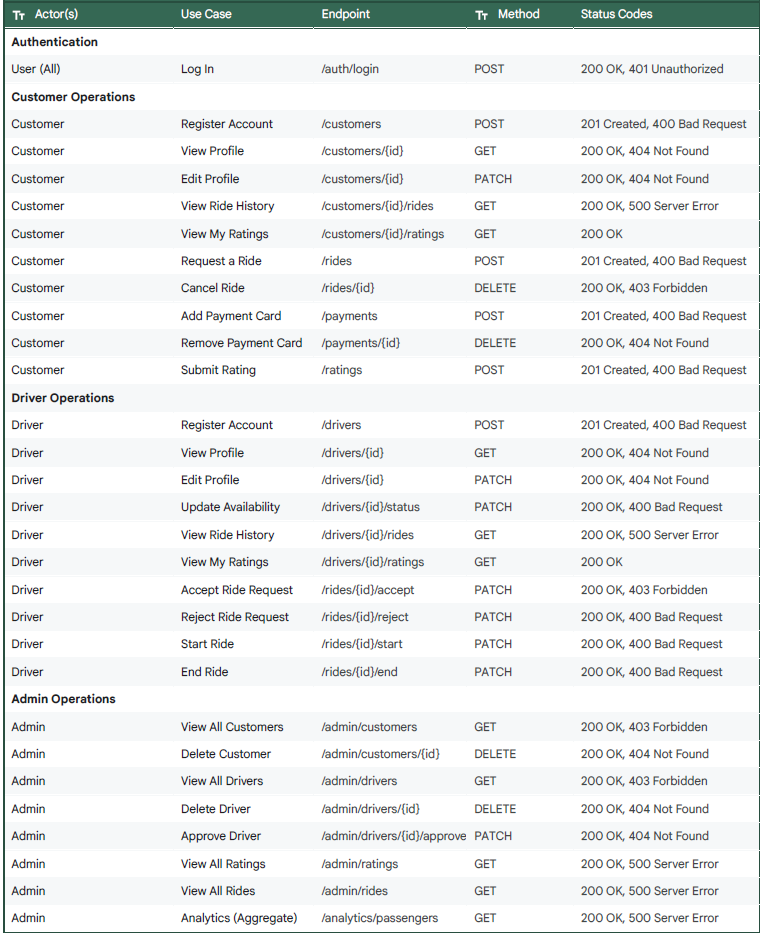
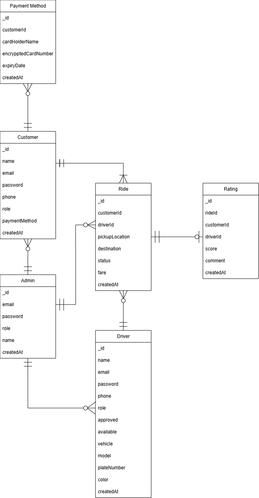

# Hello MongoDB Project

## Installation Steps

### 1. Install VSCode
- Download from [https://code.visualstudio.com](https://code.visualstudio.com)
- Install MongoDB extension.

### 2. Install Node.js and npm
```bash
node -v
npm -v
```

### Generate Visualization Dashboard with Postman 


### DESIGN THE USE CASE DIAGRAM


### DEFINE API SPECIFICATIONS


### DESIGN THE ERD Diagram


## MongoDB Atlas Data Model Structure
