# Hello MongoDB Project

## Installation Steps

### 1. Install VSCode
- Download from [https://code.visualstudio.com](https://code.visualstudio.com)
- Install MongoDB extension.

### 2. Install Node.js and npm
```bash
node -v
npm -v
```

## Week 6 Tasks

## Postman Endpoints Implementation & MongoDB Data Model
### 1. User Registration (Creating the Admin)
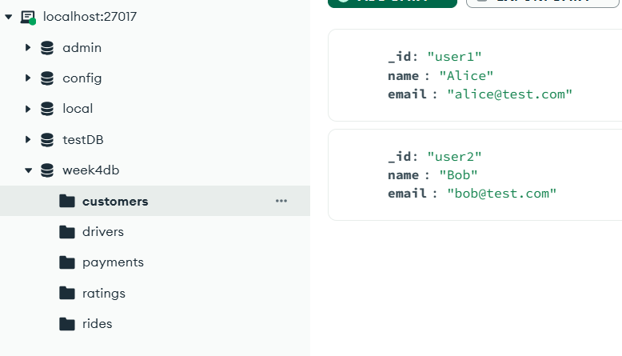


### 2. Promote the User Created to Admin in MongoDB
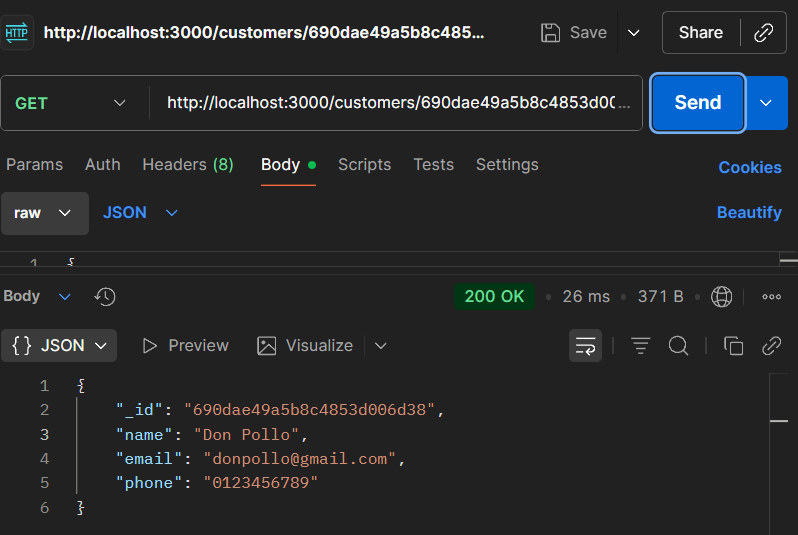

### 3. User Login (Creating the Admin Token)
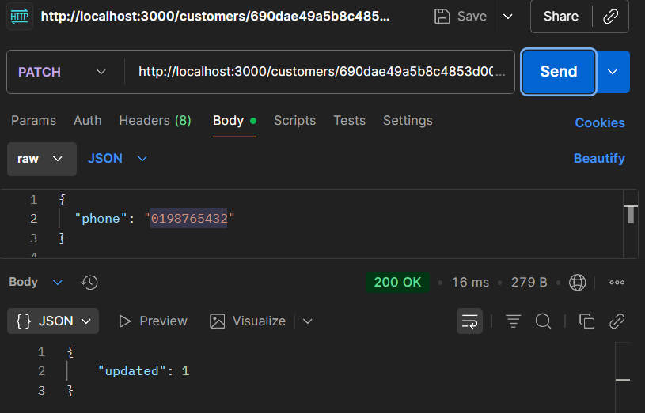

### 4. Access Protected Endpoint (Delete a User)
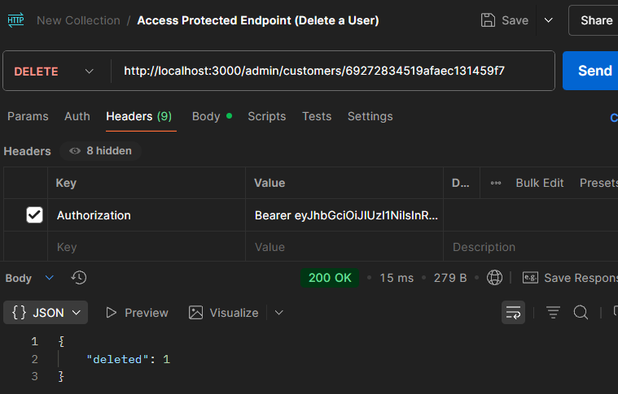

### 5. Access Protected Endpoint (Delete a User without a Token)


## Lab Questions:
### 1. Token Usage
### 1a. What happens if you omit the Authorization header when accessing /admin/users/{id}?
#### - As shown in Part "6.", I will receive a 401 Unauthorized status code. This is because The authenticate middleware in the Index.js code specifically checks req.headers.authorization. If it is undefined or empty, the code executes to return res.status(401).json({ error: "Unauthorized" });.

### 1b. What error occurs if you use an expired token?
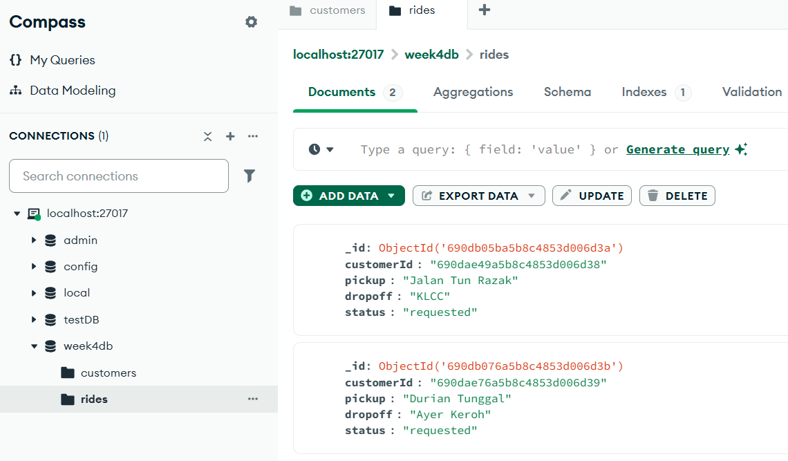
#### - As shown image above, I will receive a 401 Unauthorized status code with the message "Invalid token". This is because when jwt.verify() encounters an expired token, it throws an error and returns the 401 status.

### 1c. Paste the token generated to https://jwt.io, and discuss the content.
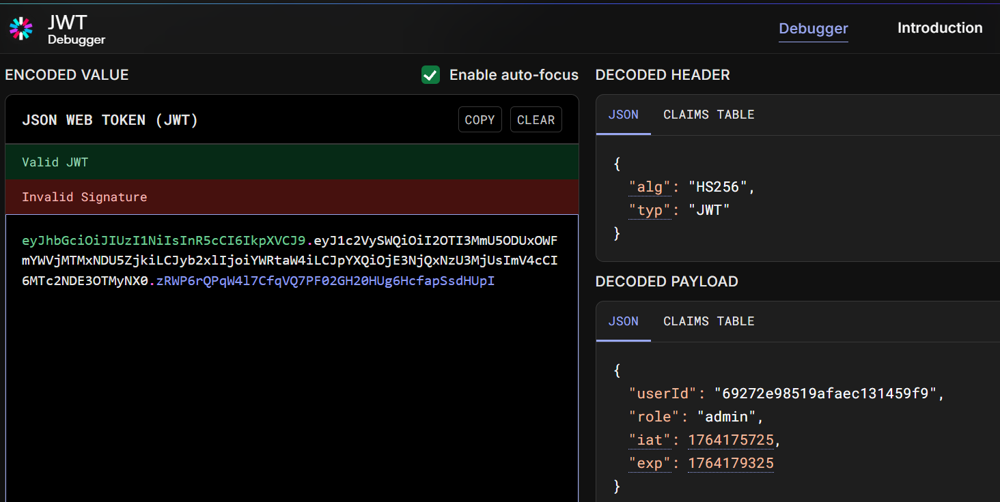
#### - As shown image above, jwt shows its document ID from MongoDB, its role (admin), iat: "Issued At" timestamp and "exp" a timestamp indicating when the token expires (1 hour from creation).

### 2. Role Restrictions
### 2a. If a customer-role user tries to access /admin/users/{id}, what status code is returned?
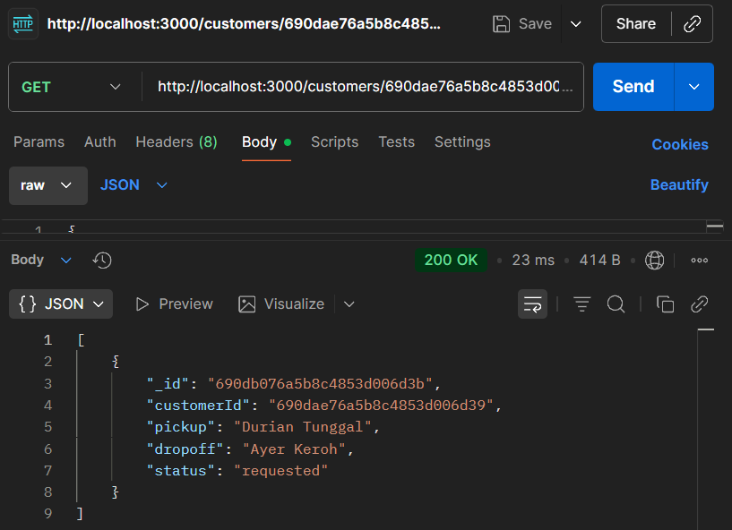
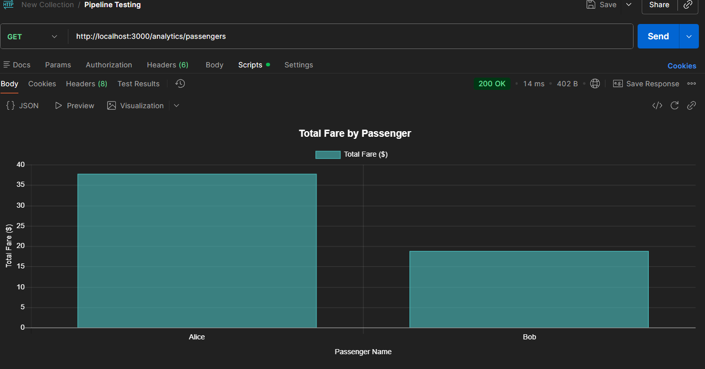
#### - As shown image above, I will receive a 403 Forbidden with the message "error": "Forbidden". This is because the authenticate middleware successfully verifies the token, but the authorize ('admin') middleware checks the role. Since "customer" is not in the allowed list ['admin'], it returns a 403 error .

### 2b. How would you modify the middleware to allow both admin and driver roles to access an endpoint?
#### - Need to pass an array containing both roles to the authorize function in the definition. for example: app.get('/some-endpoint', authenticate, authorize(['admin', 'driver']), (req, res) => { ... });


### 3. Security
### 3a. Why is the JWT token sent in the Authorization header instead of the request body?
#### - GET requests usually do not have a request body, so headers are the only consistent place to put authentication data across all request types (GET, POST, DELETE). It keeps the "security pass" (the token) separate from the "actual data" (email or password). It makes the API cleaner and easier to manage.

### 3b. How does password hashing protect user data in a breach?
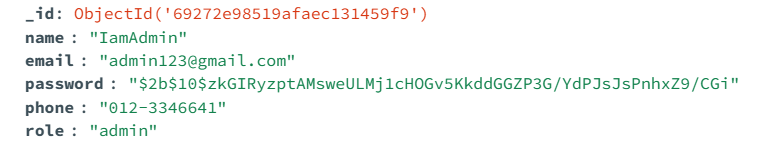
#### - If hackers steal the database, they will only see random hashed strings shown image above instead of actual passwords like 'password123'. This is because hashing is a one-way function, the attackers cannot easily reverse the hash to reveal the original password, preventing them from logging into user accounts.


### 4. Postman Testing
### 4a. What is the purpose of the Bearer keyword in the Authorization header?
#### - This helps the server separate the keyword from the actual code. "Bearer" literally means "whoever holds this." It tells the server to give access to the bearer (holder) of the token, similar to how whoever holds a cash bill owns that value.

### 4b. How would you test a scenario where a user enters an incorrect password?

#### - As shown image above, the response will displays a 401 Unauthorized status code and does not return a token.


### DESIGN THE USE CASE DIAGRAM


### DEFINE API SPECIFICATIONS
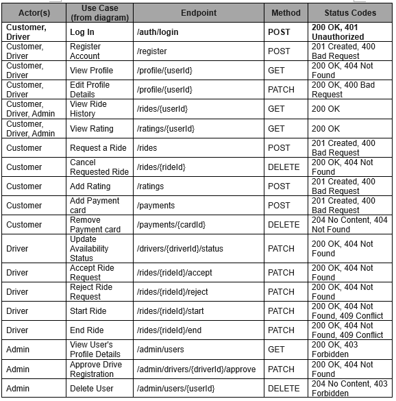

## MongoDB Data Model Structure
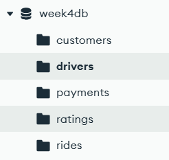