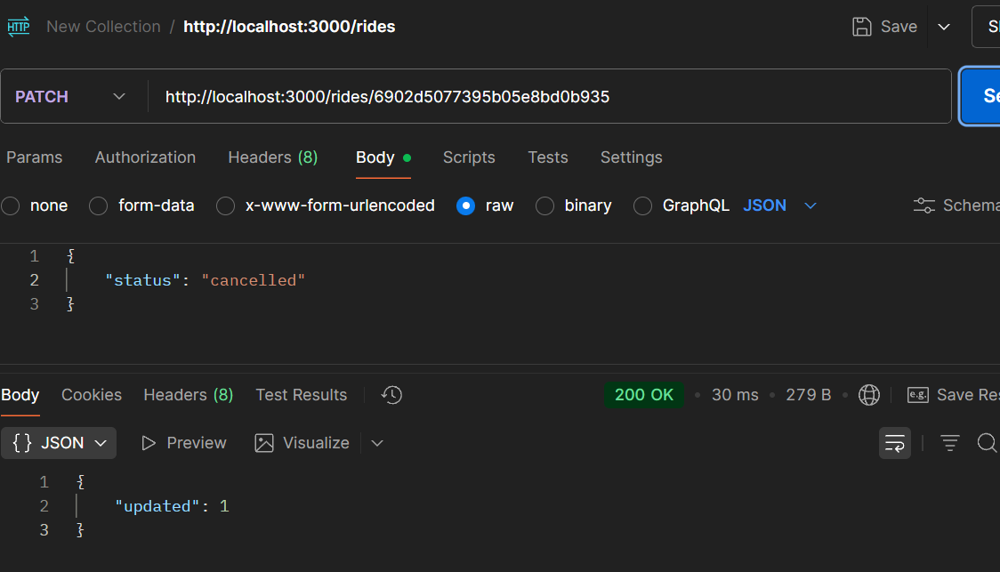

# Hello MongoDB Project

## Installation Steps

### 1. Install VSCode
- Download from [https://code.visualstudio.com](https://code.visualstudio.com)
- Install MongoDB extension.

### 2. Install Node.js and npm
```bash
node -v
npm -v
```

## Week 4 Tasks

### 1. Create a Ride


### 2. Fetch All Rides


### 3. Update Ride Status


### 4. Delete a Ride


## Lab Questions

## 1. POST Request:
### 1a. "What HTTP status code is returned when a ride is created successfully?"

### Answer 1a: "201 Created"


### 1b. "What is the structure of the response body?"

### Answer 1b: {"id": "6902cafa5ee8278b4935f327"}


## 2. GET Request:
### 2a. "What happens if the rides collection is empty?"

### Answer 2a:  - It return an empty array [] with a 200 OK status.


### 2b. "What data type is returned in the response (array/object)?"

### Answer 2b: The response shows with square bracket "[]", which means it is a **JSON array**.


## 3. Fix PATCH and DELETE Error:
### 3a. "Catch the error when requesting PATCH or DELETE API, then try to fix the issue reported"

### Answer 3a: 
### Error: 
### 
### Fix: Change this line "const { MongoClient } = require('mongodb');" to "const { MongoClient, ObjectId } = require('mongodb');"
### 
### 


### 3b. "If you try to update a non-existent ride ID, what status code is returned?"

### Answer 3b: ###  - It returned 404 Not Found.


### 3c. "What is the value of updated in the response if the update succeeds?"

### Answer 3c: It returned { "updated": 1 }, so the value is 1.


### 3d. "How does the API differentiate between a successful deletion and a failed one?"

### Answer 3d: For successful deletion, it returned 200 OK status with { "deleted": 1 }.  For failed deletion, it returned 404 Bad Request or 404 Not Found.


## 4. Users Endpoints:
### "Based on the exercise above, create the endpoints to handle the CRUD operations for users account"

### Answer 4:  - POST 
###  - GET 
###  - PATCH 
###  - DELETE


## 5. FrontEnd:
### "Upload the Postman JSON to any AI tools, and generate a simple HTML and JS Dashboard for you"

### Answer 5: ### 
### 